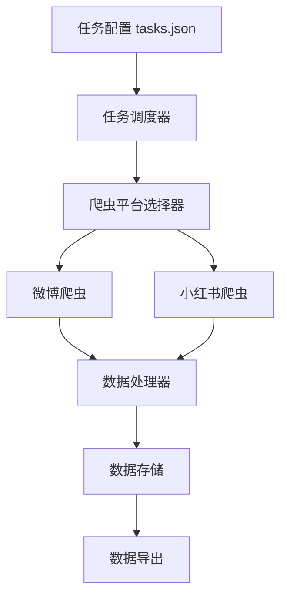
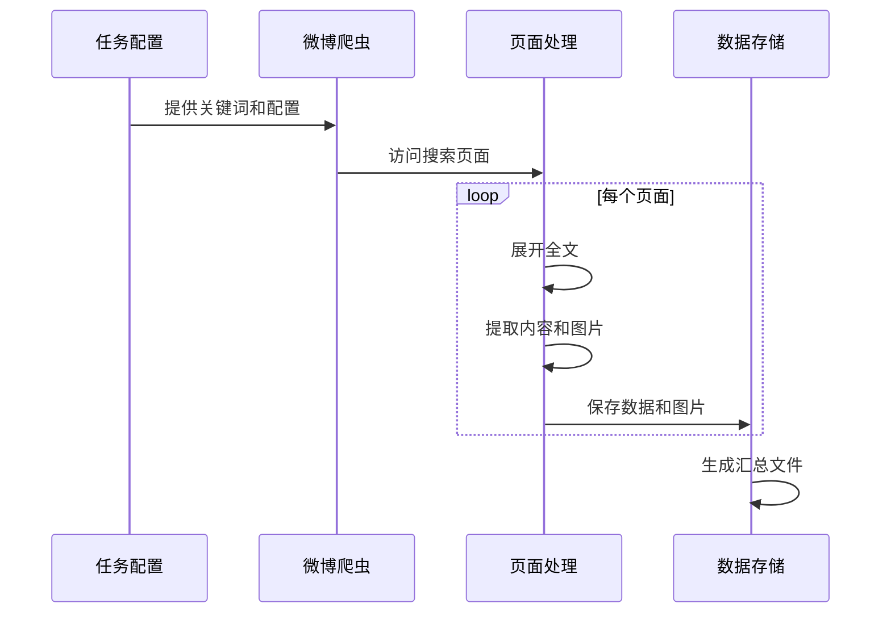
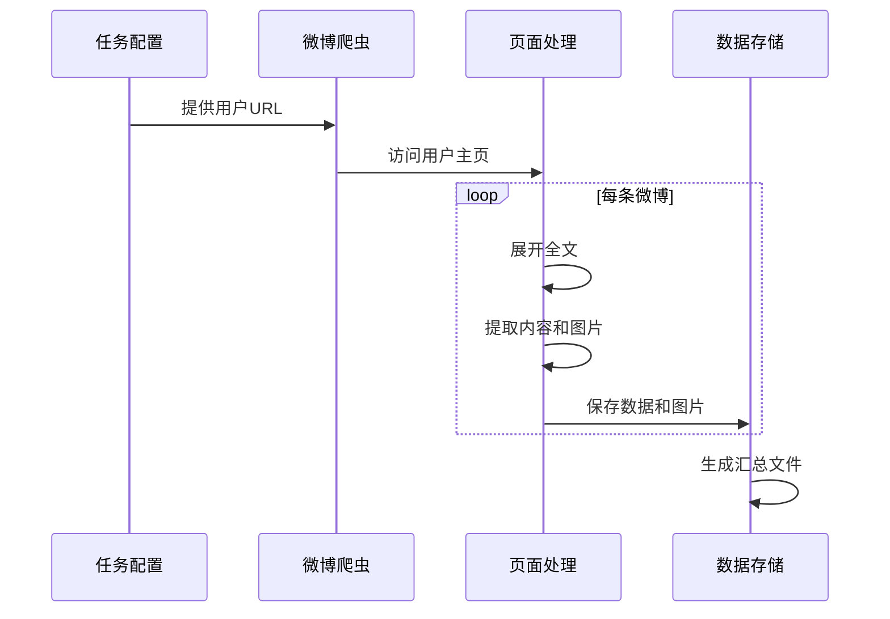
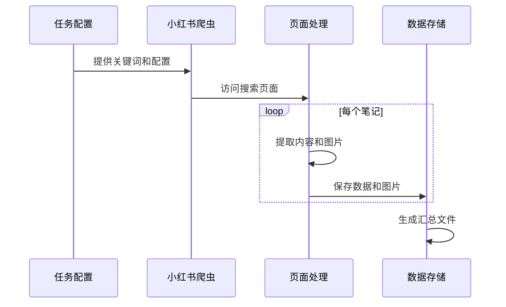
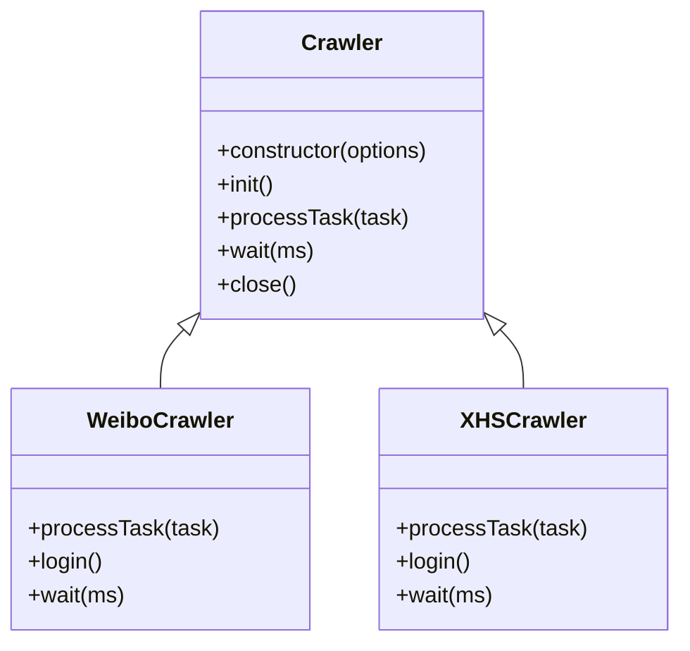
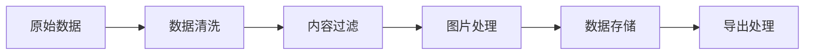
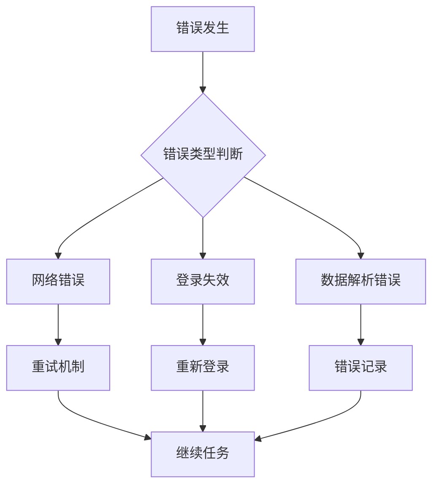

# 微博和小红书爬虫项目设计文档

## 1. 系统架构

### 1.1 整体架构



### 1.2 核心组件

- **任务配置器**：负责读取和解析tasks.json配置文件
- **任务调度器**：根据任务类型分发到对应的爬虫平台
- **爬虫平台**：实现具体的数据采集逻辑
- **数据处理器**：统一处理和清洗采集到的数据
- **数据存储**：将数据保存到本地文件系统
- **数据导出**：支持多种格式的数据导出

## 2. 任务流程图

### 2.1 微博关键词搜索流程



### 2.2 微博用户主页爬取流程



### 2.3 小红书关键词搜索流程



## 3. 组件设计

### 3.1 基础爬虫类



### 3.2 数据处理流程



## 4. 配置说明

### 4.1 任务配置格式

```json
{
  "tasks": [
    {
      "type": "wb_keyword",  // 微博关键词搜索
      "keyword": "关键词",
      "max_items": 20,
      "noimage": true,
      "export": "./导出目录"
    },
    {
      "type": "wb_user",    // 微博用户主页
      "keyword": "用户URL",
      "max_items": 20,
      "noimage": false,
      "export": "./导出目录"
    },
    {
      "type": "xhs_keyword", // 小红书关键词搜索
      "keyword": "关键词",
      "max_items": 20,
      "noimage": true,
      "export": "./导出目录"
    }
  ]
}
```

### 4.2 数据存储结构

```
data/
├── keyword_关键词_日期/
│   ├── post_1/
│   │   ├── content.json
│   │   └── images/
│   ├── post_2/
│   └── keyword_关键词_日期.txt
└── 导出目录/
    └── keyword_关键词_日期.md
```

## 5. 错误处理

### 5.1 错误处理流程



## 6. 性能优化

### 6.1 性能优化策略

- 并发控制
- 请求延迟
- 资源释放
- 数据缓存
- 错误重试

## 7. 安全措施

### 7.1 安全控制

- Cookie管理
- 请求频率控制
- 代理IP轮换
- 异常检测
- 数据加密